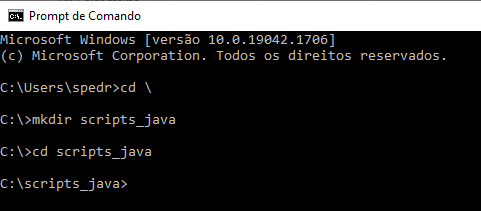
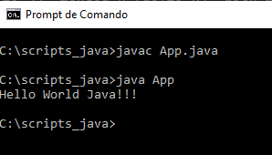

# 1. Hello World Java

# Nosso primeiro programa em Java: imprimindo uma linha de texto.

<p>
Vamos criar o nosso primeiro programa utilizando a linguagem de programação Java, mas antes ...
Vamos verificar a instalação do Java realizada no computador, lembre-se, eu estou utilizando o Sistema Operacional Windows neste tutorial, em outros sistemas a forma de operacionalização é um pouco diferente, no futuro atualizarei o tutorial com manipulações no Sistema Operacional Linux.

1. Clique no botão iniciar do Windows, na caixa de pesquisa digite: <em>cmd</em> e pressione "ENTER". O prompt de comando será inicializado.
2. No prompt de comando digite: <em>java -version</em></li>
</p>
> Observe que o terminal retorna uma resposta, informando a versão do Java instalado no Sistema Operacional do computador. Se o terminal retornar alguma mensagem de não reconhecimento do Java, possívelmente o Java não foi instalado no seu computador. Retorne para seção de introdução, para o tutorial indicado sobre a instalação e configuração do Java.
> Também é informado a versão do Java instalado, no caso, no momento da construção deste tutorial, a versão utilizada é a 18.0.1.1. Se sua versão for maior ou igual a 8.0.0.0, está tudo bem, você pode seguir em frente neste treinamento, caso contrário você deve retornar ao tutorial de instalação do Java e atualizá-lo.


<p>
3. Após confirmação da instalação do  Java, ainda no prompt de comando para acessar a raiz do disco (C:\), digite: <em>cd \</em>
4. Em seguida, para criar um diretório, digite: <em>mkdir scripts_java</em> e pressione ENTER
5. Digite <em>cd scripts_ java</em> para acessar o diretório criado.
</p>



<p>
6. Carregue o programa bloco de notas.
7. Digite o script abaixo:
</p>

```java
public class App {
	public static void main(String[] args) {
		System.out.println("Hello World Java!!!");
	}
}
```

<p>
   8. Salve na pasta "scripts_java" criada na unidade (C:\) com o nome "App.java"</li>
   9. Retorne para o terminal e digite o comando: <em>javac App.java</em>
   10. Em seguida, digite o comando: <em>java App</em>
</p>



> Observe que o script do arquivo App.java é compilado para App.class e após execução do comando <em>java App</em> o script é executado, retonando "Hello World Java!!!". Nas próximas seções aprenderemos sobre cada comando digitado no código-fonte App.java.

**criamos um programa que imprime uma mensagem na tela.**
