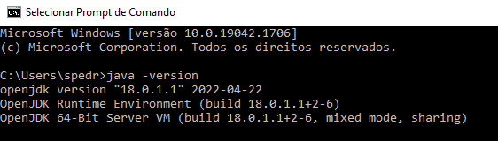

# 1. Hello World Java

# Nosso primeiro programa em Java: imprimindo uma linha de texto.

Vamos criar o nosso primeiro programa utilizando a linguagem de programação Java, mas antes ...
Vamos verificar a instalação do Java realizada no computador, lembre-se, eu estou utilizando o Sistema Operacional Windows neste tutorial, em outros sistemas a forma de operacionalização é um pouco diferente, no futuro atualizarei o tutorial com manipulações no Sistema Operacional Linux.

<ol>
  <li>Clique no botão iniciar do Windows, na caixa de pesquisa digite: "cmd" e pressione "ENTER". O prompt de comando será inicializado.</li>
  <li>No prompt de comando digite: java -version</li>
  
  > Observer que o terminal retorna uma resposta, informando o versão do Java instalado no Sistema Operacional do computador. Se o terminal retornar alguma mensagem de não reconhecimento do Java, possívelmente o Java não foi instalado no seu computador. Retorne para seção de introdução, para o tutorial indicado  
</ol>

